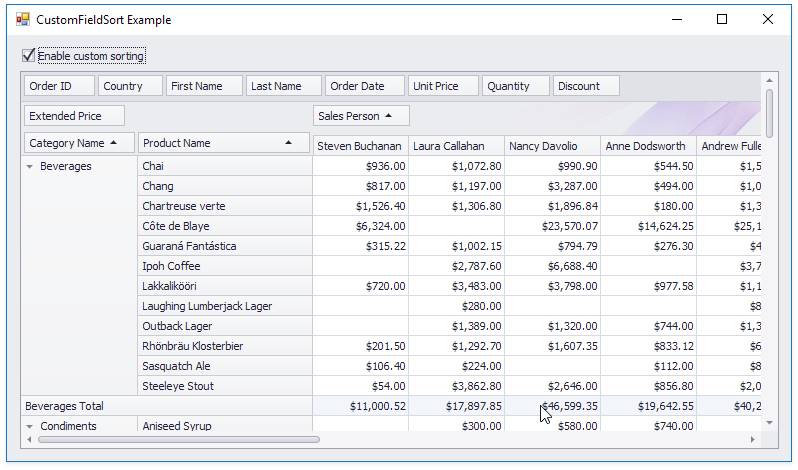

<!-- default file list -->
*Files to look at*:

* [Form1.cs](./CS/Form1.cs) (VB: [Form1.vb](./VB/Form1.vb))
* [Program.cs](./CS/Program.cs) (VB: [Program.vb](./VB/Program.vb))
<!-- default file list end -->
# CustomFieldSort - How to Use a Hidden Field to Sort the Visible Field

This example demonstrates how to sort a field (_Sales Person)_ by the hidden data field values (_Last Name_).

Check the _Enable custom sorting_ box to sort the _Sales Person_ values by _Last Name_ instead of the default alphabetical sorting order.

The checked _Enable custom sorting_ box switches the [PivotGridField.SortMode](https://docs.devexpress.com/CoreLibraries/DevExpress.XtraPivotGrid.PivotGridFieldBase.SortMode) property to the [PivotSortMode.Custom](https://docs.devexpress.com/CoreLibraries/DevExpress.XtraPivotGrid.PivotSortMode) value. This setting instructs the PivotGridControl to fire the [PivotGridControl.CustomFieldSort](https://docs.devexpress.com/WindowsForms/DevExpress.XtraPivotGrid.PivotGridControl.CustomFieldSort) event for that field.

The CustomFieldSort handler checks the [e.SortLocation](https://docs.devexpress.com/CoreLibraries/DevExpress.XtraPivotGrid.PivotGridCustomFieldSortEventArgsBase-1.SortLocation) property to determine whether the field values are displayed in the pivot grid, or in the filter popup. 

If the field is displayed in the pivot grid, the code compares values obtained from the _Last Name_ column and assigns the result to the [e.Result](https://docs.devexpress.com/CoreLibraries/DevExpress.XtraPivotGrid.PivotGridCustomFieldSortEventArgsBase-1.Result) property.

If the field is displayed in the filter popup, the _e.ListSourceRowIndex1_ and _e.ListSourceRowIndex2_ properties are always -1 and cannot be used to indicate the underlying data row. In this situation, the comparison algorithm processes the field value itself.

API in this example:

* [PivotGridField.SortMode](https://docs.devexpress.com/CoreLibraries/DevExpress.XtraPivotGrid.PivotGridFieldBase.SortMode) property
* [PivotSortMode](https://docs.devexpress.com/CoreLibraries/DevExpress.XtraPivotGrid.PivotSortMode) enumeration
* [PivotGridControl.CustomFieldSort](https://docs.devexpress.com/WindowsForms/DevExpress.XtraPivotGrid.PivotGridControl.CustomFieldSort) event
* [PivotGridCustomFieldSortEventArgs.SortLocation](https://docs.devexpress.com/CoreLibraries/DevExpress.XtraPivotGrid.PivotGridCustomFieldSortEventArgsBase-1.SortLocation) property
* [PivotGridCustomFieldSortEventArgs.ListSourceRowIndex1](https://docs.devexpress.com/CoreLibraries/DevExpress.XtraPivotGrid.PivotGridCustomFieldSortEventArgsBase-1.ListSourceRowIndex1) property
* [PivotGridCustomFieldSortEventArgs.ListSourceRowIndex2](https://docs.devexpress.com/CoreLibraries/DevExpress.XtraPivotGrid.PivotGridCustomFieldSortEventArgsBase-1.ListSourceRowIndex2) property
* [PivotGridCustomFieldSortEventArgs.Value1](https://docs.devexpress.com/CoreLibraries/DevExpress.XtraPivotGrid.PivotGridCustomFieldSortEventArgsBase-1.Value1) property
* [PivotGridCustomFieldSortEventArgs.Value2](https://docs.devexpress.com/CoreLibraries/DevExpress.XtraPivotGrid.PivotGridCustomFieldSortEventArgsBase-1.Value2) property
* [PivotGridCustomFieldSortEventArgs.GetListSourceColumnValue](https://docs.devexpress.com/CoreLibraries/DevExpress.XtraPivotGrid.PivotGridCustomFieldSortEventArgsBase-1.GetListSourceColumnValue(System.Int32-System.String)) method
* [PivotGridCustomFieldSortEventArgs.Result](https://docs.devexpress.com/CoreLibraries/DevExpress.XtraPivotGrid.PivotGridCustomFieldSortEventArgsBase-1.Result) property
* [PivotGridCustomFieldSortEventArgs.Handled](https://docs.devexpress.com/CoreLibraries/DevExpress.XtraPivotGrid.PivotGridCustomFieldSortEventArgsBase-1.Handled) property

**See also:**

* [Sorting](https://docs.devexpress.com/WindowsForms/1809)
* [Binding to Excel Data Source](https://docs.devexpress.com/WindowsForms/115529)
