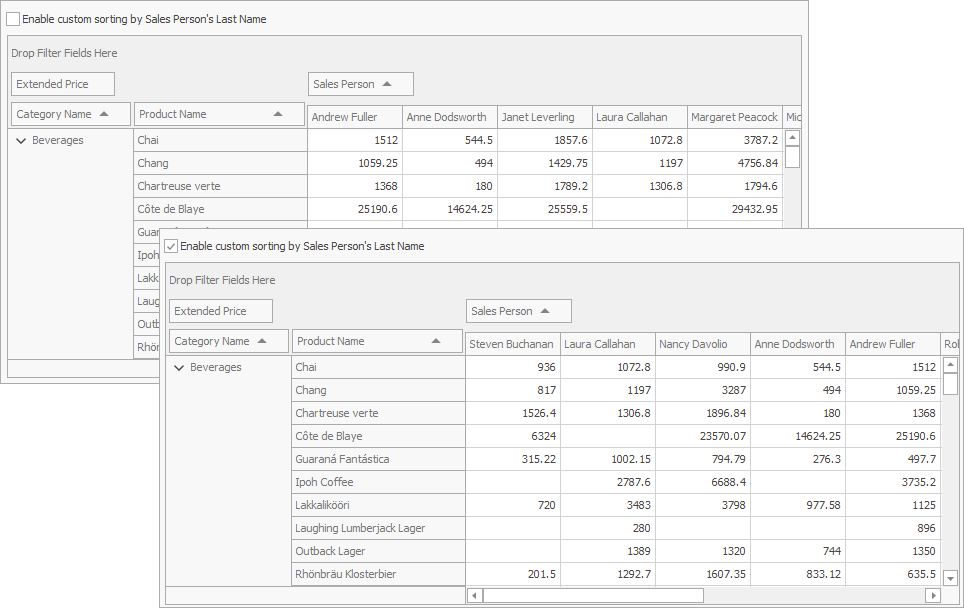

<!-- default badges list -->

<!-- default badges end -->
<!-- default file list -->
*Files to look at*:

* [Form1.cs](./CS/CustomSortingExample/Form1.cs) (VB: [Form1.vb](./VB/CustomSortingExample/Form1.vb))
* [Program.cs](./CS/CustomSortingExample/Program.cs) (VB: [Program.vb](./VB/CustomSortingExample/Program.vb))
<!-- default file list end -->
# CustomFieldSort - How to Use a Hidden Field to Sort the Visible Field

This example demonstrates how to sort a field (_Sales Person)_ by the hidden data field values (_Last Name_).

Check the _Enable custom sorting_ box to sort the _Sales Person_ values by _Last Name_ instead of the default alphabetical sorting order.

The checked _Enable custom sorting_ box switches the [PivotGridField.SortMode](https://docs.devexpress.com/CoreLibraries/DevExpress.XtraPivotGrid.PivotGridFieldBase.SortMode) property to the [PivotSortMode.Custom](https://docs.devexpress.com/CoreLibraries/DevExpress.XtraPivotGrid.PivotSortMode) value. This setting instructs the PivotGridControl to fire the [PivotGridControl.CustomFieldSort](https://docs.devexpress.com/WindowsForms/DevExpress.XtraPivotGrid.PivotGridControl.CustomFieldSort) event for that field.

The CustomFieldSort handler compares values obtained from the _Last Name_ column and assigns the result to the [e.Result](https://docs.devexpress.com/CoreLibraries/DevExpress.XtraPivotGrid.PivotGridCustomFieldSortEventArgsBase-1.Result) property.

API in this example:

* [PivotGridField.SortMode](https://docs.devexpress.com/CoreLibraries/DevExpress.XtraPivotGrid.PivotGridFieldBase.SortMode) property
* [PivotSortMode](https://docs.devexpress.com/CoreLibraries/DevExpress.XtraPivotGrid.PivotSortMode) enumeration
* [PivotGridControl.CustomFieldSort](https://docs.devexpress.com/WindowsForms/DevExpress.XtraPivotGrid.PivotGridControl.CustomFieldSort) event
* [PivotGridCustomFieldSortEventArgs.ListSourceRowIndex1](https://docs.devexpress.com/CoreLibraries/DevExpress.XtraPivotGrid.PivotGridCustomFieldSortEventArgsBase-1.ListSourceRowIndex1) property
* [PivotGridCustomFieldSortEventArgs.ListSourceRowIndex2](https://docs.devexpress.com/CoreLibraries/DevExpress.XtraPivotGrid.PivotGridCustomFieldSortEventArgsBase-1.ListSourceRowIndex2) property
* [PivotGridCustomFieldSortEventArgs.GetListSourceColumnValue](https://docs.devexpress.com/CoreLibraries/DevExpress.XtraPivotGrid.PivotGridCustomFieldSortEventArgsBase-1.GetListSourceColumnValue(System.Int32-System.String)) method
* [PivotGridCustomFieldSortEventArgs.Result](https://docs.devexpress.com/CoreLibraries/DevExpress.XtraPivotGrid.PivotGridCustomFieldSortEventArgsBase-1.Result) property
* [PivotGridCustomFieldSortEventArgs.Handled](https://docs.devexpress.com/CoreLibraries/DevExpress.XtraPivotGrid.PivotGridCustomFieldSortEventArgsBase-1.Handled) property

**See also:**

* [Sorting](https://docs.devexpress.com/WindowsForms/1809)
